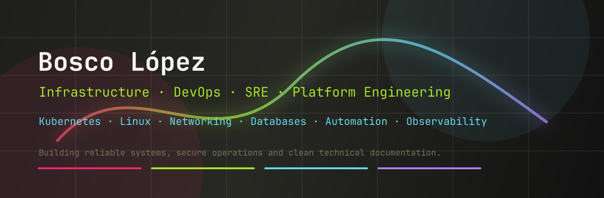

  

# Hi, I'm Bosco López Alvarez 👋

**Infrastructure, DevOps, SRE, and Platform Engineering.**

I specialize in designing, automating, and maintaining reliable infrastructure, cloud platforms, and network systems.

I work mainly with:

- **Cloud & Orchestration:** Linux, Kubernetes, Docker, OpenStack & CI/CD pipelines
- **Databases & Storage:** PostgreSQL, MySQL, MongoDB, Redis & Ceph
- **Networking & Security:** MikroTik, Cisco Nexus, Sophos & network infrastructure
- **Automation & Observability:** Python, APIs, Bash, Ansible & Monitoring tools

---

## 🎯 Current Focus

- Reliable infrastructure operations & HA clustering
- Backup and restore automation (Disaster Recovery)
- Kubernetes observability & performance tuning
- Network and security automation
- Technical documentation, runbooks, and educational content

---

## 📢 Content Creation & Community

Besides engineering, I create educational content and tutorials about Cloud Computing, Linux Administration, and Networking on my [YouTube Channel](https://www.youtube.com/@BoscoLopez) and share insights on my [Blog](https://boscolopez.com).

---

## 🛠️ Technical Stack

You can find a more detailed overview of my technical stack and tools here:

👉 [**View my detailed technical stack**](./docs/stack.md)

---
